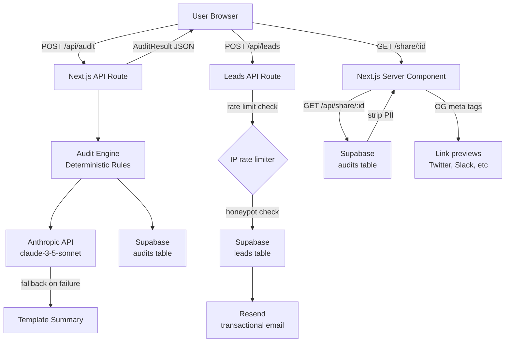

# ARCHITECTURE.md

## System Diagram

## Data Flow: Input → Audit Result

1. **User fills the form** — selects tools, plan, seats, actual monthly spend. State persists to `localStorage` on every keystroke.

2. **Submit hits `POST /api/audit`** — Zod validates the payload. If malformed, returns 400.

3. **`runAudit()` runs synchronously** — evaluates each tool entry against hardcoded rules:
   - Is this plan right-sized for the team/use case?
   - Is there a cheaper same-vendor plan that fits?
   - Is there a cheaper alternative tool with comparable capability?
   - Are they paying retail when credits exist?
   - Applies cross-tool overlap detection (e.g., Cursor + Copilot simultaneously).

4. **Anthropic API call** — sends audit data as structured context to `claude-3-5-sonnet`. If the API is down or returns an error, `generateFallbackSummary()` runs deterministically from the audit data. No user-facing error either way.

5. **Persist to Supabase** — `audits` table stores the full JSON. If Supabase is unavailable, the API still returns the result to the user (fire-and-forget storage).

6. **Return `AuditResult`** — includes `id` (nanoid), all recommendations, savings totals, AI summary.

7. **Share URL** — `GET /share/:id` fetches the audit from Supabase, strips PII (email, company), and renders a server component with dynamic OG tags.

## Stack Choice

**Next.js 14 (App Router)**
- Server components for the share page (SEO + OG tags server-rendered)
- API routes co-located with the app (one deploy, no separate backend)
- Built-in TypeScript, ESLint config
- Vercel deploys from `git push` in 30 seconds

**TypeScript**
Required by the brief and the right call. The audit engine's type system catches entire classes of bugs at compile time — no runtime surprises about whether `monthlySpend` could be a string.

**Tailwind CSS (utility classes in inline styles)**
Used inline `style` props directly rather than Tailwind class strings for the majority of components. Reason: the design was iterated in code without a separate design file, and inline styles make the relationship between values explicit without a build step for CSS-in-JS. Tailwind is configured and used for body/reset styles.

**Supabase**
Free tier, instant setup, real Postgres underneath, great dashboard for reviewing leads without an admin panel.

**Resend**
Better developer experience than SES for transactional email at this scale. Free tier allows 100 emails/day.

## Scaling to 10k Audits/Day

1. **Audit engine** — pure in-memory computation, stateless. No changes needed; it'd handle millions of calls.

2. **Supabase** — the free tier handles ~50 concurrent connections. At 10k audits/day (~7/minute average), this is fine. At spiky traffic, use connection pooling (PgBouncer, built into Supabase).

3. **AI summary** — Anthropic API has rate limits. At 10k/day, queue AI summary requests via a Redis-backed job queue (BullMQ). Return the audit immediately, push the summary via WebSocket/polling once it completes.

4. **Rate limiting** — move from in-memory to a Redis-backed limiter (`@upstash/ratelimit`) that works across serverless instances.

5. **Caching** — cache pricing data in Redis with a 24h TTL. The current hardcoded approach requires a deploy to update pricing; a weekly cron that pulls from vendor APIs would be better.

6. **CDN** — share pages are already server-rendered with 1hr revalidation. At scale, add ISR (Incremental Static Regeneration) for the most-visited share pages.
